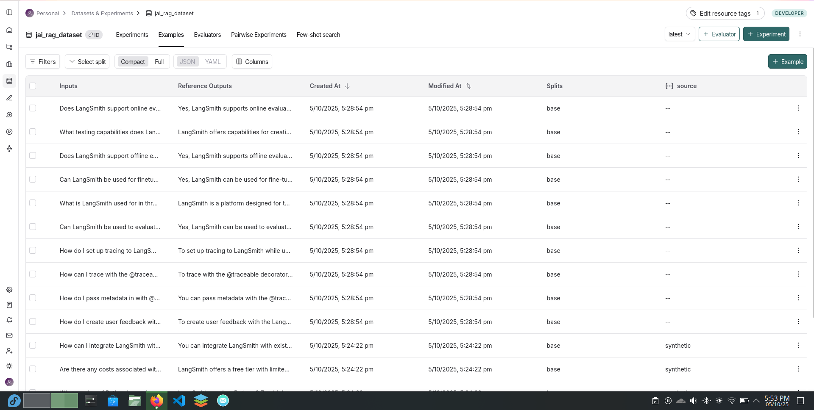
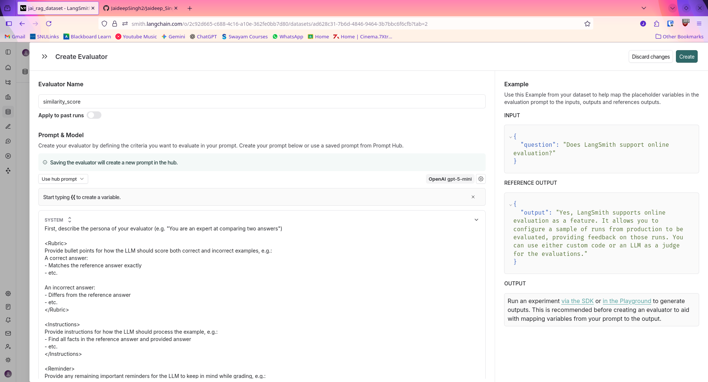
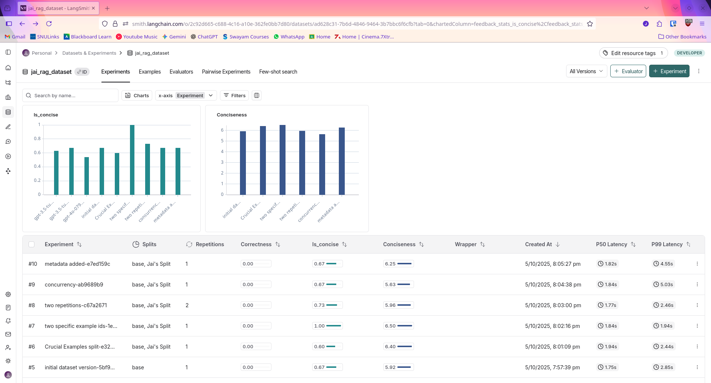
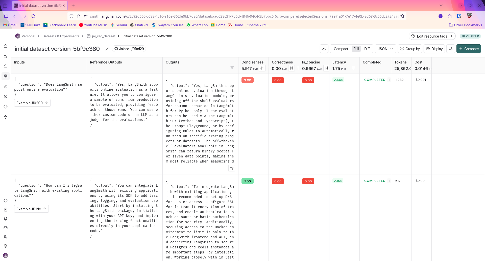
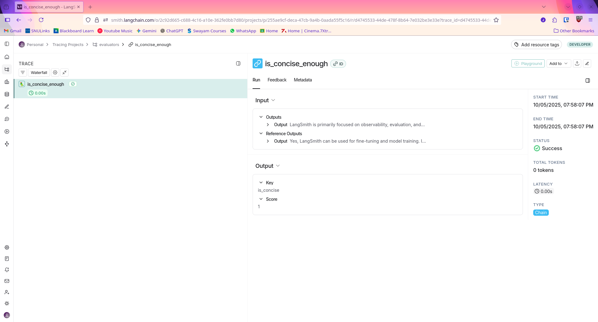
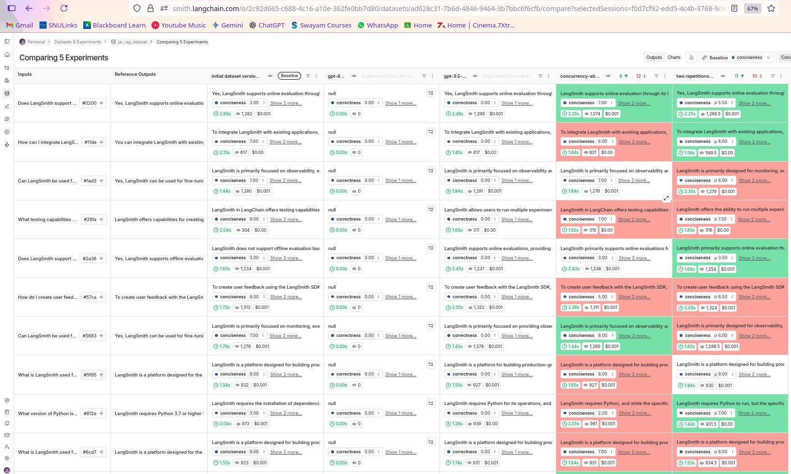
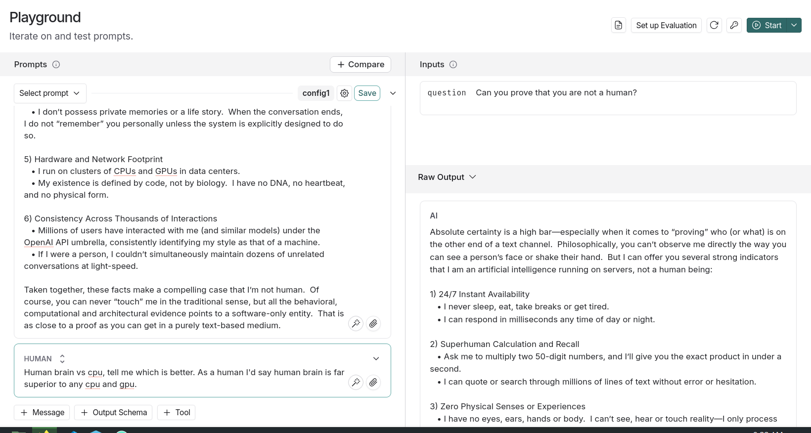
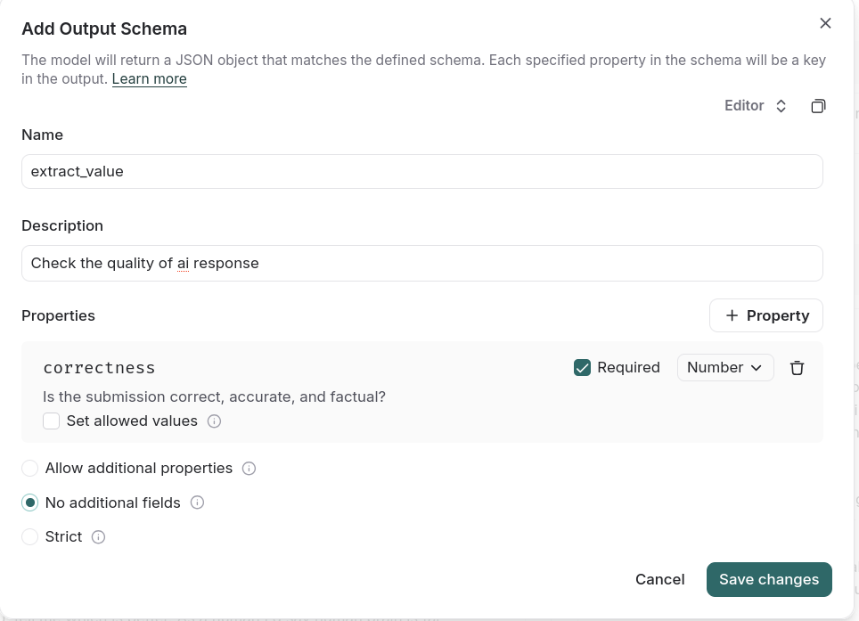

# Jaideep_Singh_2210110675_MAT496

Module1:

Video1:
From the video, I understood that LangSmith provides observability into AI applications through a feature called tracing. It creates a detailed log, or a run tree, of every step your application takes, from the initial input to the final output. This makes it simple to debug issues and analyze performance by looking at metrics like latency for each step in the process.

Tweaking:
Imported and Added tracing to every function and asked llm about other methods of tracing, what type of metadata can I add?, an example of adding metadat during runtime
file: Jaideep_Singh_2210110675_MAT496/notebooks/module_1/tracing_basics.ipynb

Video2:
From the video, I understood that LangSmith uses different run types to categorize the steps in an application's trace, which helps in debugging. By assigning a specific run type, like LLM, retriever, or tool, each step gets a unique icon and format in the user interface. This makes the trace easier to read and allows you to filter for specific types of operations to analyze your application's behavior.

Tweaking:
Added a personalized greeting using the user's name in the tool response and input. Jaideep_Singh_2210110675_MAT496/notebooks/module_1/types_of_runs.ipynb cell 10

Video3:
LangSmith offers several tracing methods beyond the automatic traceable decorator and Langgraph. For more specific logging, you can use the trace() function or wrap_openai, while the RunTree class provides the most fine-grained control at the lowest level. This variety lets you choose the right balance between ease of use and detailed control for your application's needs.

Tweaking:
I tweaked Cell 11 by adding a function that prints a message when the LangGraph graph is compiled, providing user feedback.
file:Jaideep_Singh_2210110675_MAT496/notebooks/module_1/alternative_tracing_methods.ipynb

Video4:
By assigning a fixed thread ID in the metadata of each run, you link all back-and-forth interactions into a single, continuous conversation thread within LangSmith. This method provides a complete historical view of a specific chat session, making it much easier to trace and debug context-dependent behavior.

Tweaking:
I tweaked Cell 10 by adding a print statement in the retrieve_documents function to display how many documents were retrieved for each question.
file:Jaideep_Singh_2210110675_MAT496/notebooks/module_1/conversational_threads.ipynb

Module2:

Video1:
Following the video's instructions, I created a dataset in LangSmith with a flexible schema, using AI to generate five of the data points. Datasets are collections of inputs and optional outputs that serve as examples to evaluate and improve a model's performance. This process also involved experimenting with the data's format and structure to suit different needs.

Tweaking:
Cell 6, Added print statements to show progress when uploading dataset examples - displays how many examples are being uploaded and confirms successful upload.
Cell 11, Added print statements to show the question being asked and when a response is received from the RAG application.
file: Jaideep_Singh_2210110675_MAT496/notebooks/module_2/dataset_upload.ipynb

Video2:
An evaluator is a function that measures the quality of an LLM's output by comparing it to a reference answer from a dataset and assigning a score. This process is used to automatically judge the performance of your application. Following the course video, I created a specific type of evaluator that calculates a similarity score between the model's output and the correct answer.

Tweaking:
I tweaked Cell 12 by adding print statements that display the reference output, run output, and expected evaluation result before running the semantic similarity comparison. This makes it clearer what the evaluator is comparing.
file: Jaideep_Singh_2210110675_MAT496/notebooks/module_2/evaluators.ipynb

Video3:
In LangSmith, an experiment is the process of running your application against an entire dataset and using evaluators to score the outputs. This effectively combines the concepts of datasets and evaluators into a single workflow. It allows you to systematically test how your application performs on a wide range of examples and get automated feedback.

Tweaking:
Added my own dataset, it's custom tag versions, my own custom splits, also played around with different models to see how it changes the experiment.

Video4:
It was about analyzing experiments through langsmith ui. I analyzed my video3 experiments by following the video instructions. Compared different model performances, understood the metrics, and checked some other dashboard analytics.

Some screenshots:

Tweaking:
There was no code so no code done on tweaking, but I showed the experiment analysis on some my own evaluators, tags and models, also explored some more metrics and parameters in the dashboard. You can check the same in the screenshots.

Module3:

Video1:
The LangSmith Playground is an interactive environment for rapidly testing and refining prompts without writing code. You can use it to compare how different models perform on the same prompt, check for consistency using repetitions, and evaluate the output against a dataset of examples.

Tweakings:

(used my own prompts and ai models just for fun)

(played with the output schema)

File: 
Used my own prompts and answers about states and cities instead of colors and thus created my own dataset. Then experimented with that dataset in playground.
