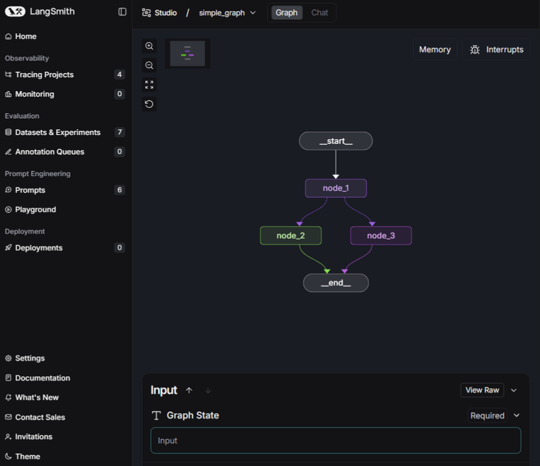

Module 1, Video1:

This video briefly explained that LangGraph helps you balance how much you can rely on an LLM with how much control you have over it. It was just a general overview of the course modules, and no code examples were shown.

Module 1, Video2:
I learned to make the graph follow a conversation by adding messages to its state and giving the AI special tools to use when necessary. I also covered the basics of nodes and graphs and how to create them. The code showed how a graph works, similar to a neural network, but we used random numbers instead of an LLM to decide the next step.

Tweaking:
Added a cell in the last that demonstrates and tests the random node selection behavior by running the graph multiple times and tracking which nodes were selected.

file: 

Module 1, Video3:
In this video, we used the Langsmith studio interface for the first time. It helps with debugging and reviewing different cases, giving a clear visual view of our structure. No coding was done in this video.

