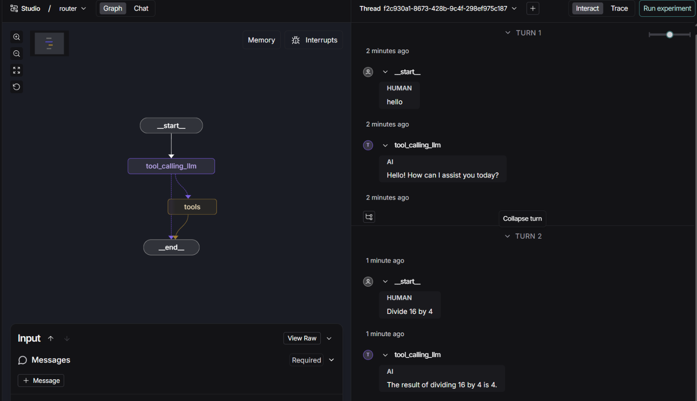
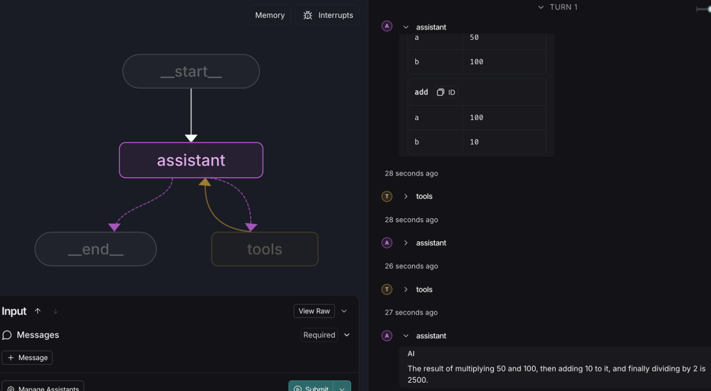

Module 1, Video1:

This video briefly explained that LangGraph helps you balance how much you can rely on an LLM with how much control you have over it. It was just a general overview of the course modules, and no code examples were shown.

Module 1, Video2:
I learned to make the graph follow a conversation by adding messages to its state and giving the AI special tools to use when necessary. I also covered the basics of nodes and graphs and how to create them. The code showed how a graph works, similar to a neural network, but we used random numbers instead of an LLM to decide the next step.

Tweaking:
Added a cell in the last that demonstrates and tests the random node selection behavior by running the graph multiple times and tracking which nodes were selected.

file: 

Module 1, Video3:
In this video, we used the Langsmith studio interface for the first time. It helps with debugging and reviewing different cases, giving a clear visual view of our structure. No coding was done in this video.

Module 1, Video4:

We expand simple graphs by connecting different concepts into chains. We start with messages, which store the whole conversation in a list. Next, we create a simple tool that performs one operation. Finally, we combine these messages and tools in a graph with an LLM model to show a chain executing successfully.

Tweaking:
I expanded the agent's capabilities by adding a new subtract tool to the list of available functions. Update the cell that defines tools and the cell that binds them to the LLM.

file: 

Module1, Video 5:
I understood that to demonstrate routing, a tool is added to the tools list. The LLM decides when to use the tool based on a preset condition. If a question is unrelated, the LLM does not call the tool, but it does use it for relevant questions.

Tweaking:
Added a new code cell at the end that demonstrates how the router graph handles an input that does not require a tool call (e.g., a general greeting). This highlights the router's ability to bypass tool usage and return a direct LLM response.

file: 

Module 1, Video 6:

In this video, we learned how to use tools recursively, meaning the output goes back to the caller until the desired result is achieved. We also added tracing to see the process and details in Langsmith, similar to what we did in Langchain.

Tweaking:

Added a new code cell at the end of the notebook that demonstrates using the agent to solve a different arithmetic sequence, showing the flexibility of the agent loop.

file: 

Module 1, Video 7:

I Learned how to add memory to the agent. Checkpoints were implemented for memory using thread id to save the state.

Tweaking:

Added a new tool modulo for modulus operation, update the tools list, and demonstrate its use in a new code cell (last cell) with memory.

file: 
